# lagosmart-retail-sales-profitability-analysis-
End-to-end retail sales and profitability analysis using Excel, SQL, and Power BI

### Project Overview

LagosMart Retail Sales & Profitability Analysis is an end-to-end business analytics project focused on evaluating sales performance, product profitability, customer performance, and operational outcomes.

The analysis uses a synthetic AI-generated retail dataset created for portfolio and analytical purposes. The dataset contains approximately 5,000 transaction records covering sales, products, customers, geographic locations, payment methods, order status, delivery status, returns, and financial metrics.

The project combines Excel, MySQL, and Power BI to transform raw data into validated analysis, interactive dashboards, and actionable business insights.

### Business Objectives

The project aims to:

- Evaluate overall sales performance across regions, states, store types, customer types, payment methods, and product categories.
- Assess product profitability and identify high- and low-performing products and categories.
- Analyze customer distribution and satisfaction across customer segments, regions, and product categories.
- Evaluate operational performance through returns, cancellations, delivery outcomes, and payment-method performance.
- Develop actionable business insights and recommendations to support revenue growth, profitability improvement, customer retention, and operational efficiency.

### Dataset Description

The analysis began with 5,008 transaction records. Following data cleaning, duplicate review, data validation, and quality checks, a final analytical dataset of approximately 5,000 records was used for the analysis.

The dataset contains fields relating to:

- Transaction and order information
- Product and product category information
- Sales, profit, and profit margin
- Customer type and customer ratings
- Geographic information
- Store type
- Payment method
- Order and delivery status
- Returns and cancellations

### Data Preparation & Cleaning

The dataset was reviewed and cleaned to improve data quality and ensure consistency before analysis.

Key preparation steps included:

- **Duplicate Records:** Transaction IDs were reviewed for duplication. Duplicate records were investigated to distinguish genuine duplicate transactions from repeated IDs with different transaction details.
- **Missing Values:** Missing and blank values were identified and reviewed, including customer ratings, discount percentages, and return-related fields.
- **Data Types & Formatting:** Data types were checked and standardized to ensure that dates, numerical fields, text fields, and categorical variables were suitable for analysis.
- **Currency & Numerical Formatting:** Monetary values were reviewed and standardized to ensure consistent numerical representation.
- **Discount Values:** Discount values were checked to ensure they were represented consistently as percentages/decimal values.
- **Sales Validation:** Sales values were checked against the expected relationship between quantity, unit price, and discount.
- **Financial Validation:** Cost, profit, and profit margin calculations were reviewed to identify inconsistencies before the final analysis.

### Data Validation

Key financial and analytical fields were validated before visualization and reporting to improve the reliability of the analysis.

The validation focused on:

- **Sales:** Checked against the expected relationship between quantity, unit price, and discount.
- **Cost:** Reviewed for consistency with the underlying transaction values.
- **Profit:** Validated against the relationship between sales and cost.
- **Profit Margin:** Reviewed to ensure that the calculated margin was consistent with profit relative to sales.

These checks helped identify data-quality issues and supported the use of the cleaned dataset for subsequent Excel, SQL, and Power BI analysis.

### Analytical Tools
The project used three analytical tools, with each tool supporting a different stage of the analysis:

- **Excel:** Used for exploratory analysis, data review, validation, and initial calculations.
- **MySQL:** Used to query the cleaned dataset, answer business questions, and perform structured analysis.
- **Power BI:** Used to develop KPIs, interactive dashboards, visual analysis, and business insights.

The tools were used together to move from data preparation and exploration to structured analysis, visualization, and business reporting.

### Calculated Metrics (KPIs)

Eight key performance indicators were developed in Power BI to provide a high-level view of LagosMart's business performance:

| KPI | Definition |
|---|---|
| **Total Sales** | Total revenue generated from recorded sales transactions. |
| **Total Profit** | Total profit generated across the analyzed transactions. |
| **Profit Margin** | Profit expressed as a proportion of total sales. |
| **Total Orders** | Distinct count of transaction/order records used in the analysis. |
| **Average Customer Rating** | Average customer rating recorded across transactions. |
| **Average Order Value (AOV)** | Average revenue generated per order. |
| **Return Rate** | Proportion of orders recorded as returned relative to total orders. |
| **Cancellation Rate** | Proportion of orders recorded as cancelled relative to total orders. |

These KPIs were used to monitor revenue, profitability, customer experience, and operational performance throughout the Power BI analysis.

### Analytical Approach

The analysis followed a business-question-driven workflow:

**Data Preparation → Exploratory Analysis → SQL Analysis → Power BI Visualization → Business Insights → Recommendations**

The cleaned dataset was first explored to understand data quality, sales patterns, profitability, customer behaviour, and operational outcomes. SQL was then used to answer structured business questions and validate analytical results.

Power BI was subsequently used to develop KPIs, interactive visualizations, and dashboards across sales, product, customer, and operational performance. The findings from the analysis were translated into business insights and actionable recommendations.

## Executive Overview

The Power BI Executive Overview provides a high-level view of LagosMart's overall business performance. It brings together the key performance indicators and selected visuals needed to quickly assess revenue, profitability, sales trends, geographic performance, and order outcomes.

### Key Performance Indicators

The Executive Overview contains eight KPIs:

- Total Sales
- Total Profit
- Profit Margin
- Total Orders
- Average Customer Rating
- Average Order Value (AOV)
- Return Rate
- Cancellation Rate

### Executive Overview Visuals

The Executive Overview also contains four key visuals:

- **Sales by Category** – provides a high-level view of revenue contribution across product categories.
- **Monthly Sales & Profit Trend** – shows how sales and profit changed over the analyzed period.
- **Sales by Region with State Drill-down** – provides a geographic view of sales performance, allowing regional results to be explored at state level.
- **Order Status Distribution** – summarizes the overall outcome of recorded orders across completed, returned, and cancelled orders.

### Business Purpose

The Executive Overview was designed to give management a quick understanding of LagosMart's financial, sales, geographic, customer, and operational performance before moving into the detailed analysis pages.

### Executive Overview Dashboard

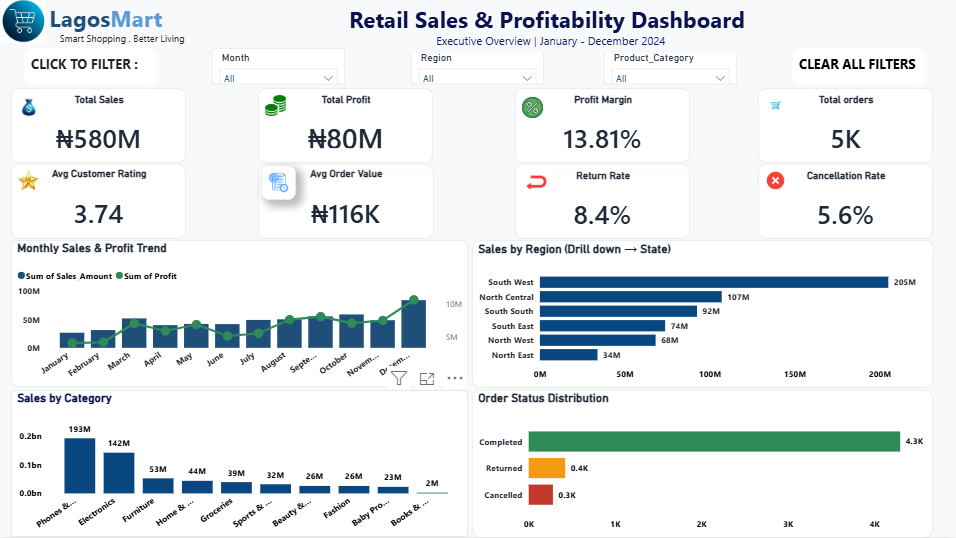

## Sales Performance

The Sales Performance analysis examines how revenue is distributed across regions, states, store types, customer types, payment methods, and product categories.

### Sales by Region

**Business Question:**  
Which region generated the highest sales revenue, and which region recorded the lowest?

**Visual:**  
Sales by Region — bar chart with drill-down to states.

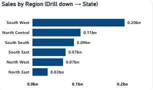

**Key Finding:**  
The Southwest generated the highest sales revenue, while the Northeast recorded the lowest sales revenue.

**Business Insight:**  
Sales performance varies considerably across regions, with the Southwest serving as LagosMart's strongest regional revenue contributor and the Northeast contributing the least.

**Recommendation:**  
Management should investigate the factors driving the Southwest's strong performance and assess which relevant practices can be adapted to other regions. A targeted review of the Northeast market should also be conducted to identify barriers to sales growth and develop region-specific improvement strategies.

### Sales by State

**Business Question:**  
Which states contributed the most to LagosMart's sales revenue?

**Visual:**  
Top 10 States by Sales — horizontal bar chart.

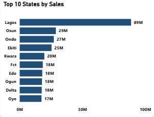

**Key Finding:**  
Lagos recorded the highest sales revenue among the states included in the Top 10 analysis.

**Business Insight:**  
Sales performance varies substantially across states, with Lagos making the strongest contribution among the leading markets. This indicates that revenue is concentrated in stronger-performing states and that market demand, customer reach, product mix, or sales execution may differ across locations.

**Recommendation:**  
Management should investigate the factors contributing to Lagos's strong performance and assess which relevant practices can be adapted to other high-potential markets. Lower-performing states should be assessed based on market demand and sales potential before additional investment decisions are made.

### Monthly Sales and Profit Trend

**Business Question:**  
How did LagosMart's sales revenue and profit change over time?

**Visual:**  

Monthly Sales and Profit Trend — combo chart.

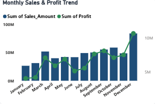

**Key Finding:**  
December recorded the highest sales revenue and highest profit, while January recorded the lowest sales revenue and lowest profit. Sales and profit generally moved in the same direction across the period.

**Business Insight:**  
LagosMart's sales and profitability were strongest towards the end of the period, with December recording the strongest performance. The concurrent movement of sales and profit suggests that stronger sales performance was generally accompanied by higher profit during the period analyzed.

**Recommendation:**  
Management should investigate the factors behind the strong December performance, including customer demand, product mix, promotional activity, and seasonal purchasing patterns, and assess which successful practices could be applied during weaker periods.

### Sales by Product Category

**Business Question:**  
Which product category generated the highest and lowest sales revenue?

**Visual:**  
Sales by Category — bar chart.

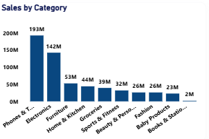

**Key Finding:**  
Phones and Tablets generated the highest sales revenue, while Books and Stationery recorded the lowest sales revenue.

**Business Insight:**  
Sales revenue is concentrated in stronger-performing product categories, with Phones and Tablets serving as the leading revenue contributor. The comparatively low contribution from Books and Stationery indicates weaker sales performance relative to other categories.

**Recommendation:**  
LagosMart should maintain appropriate inventory and targeted marketing for high-performing categories such as Phones and Tablets while investigating the factors contributing to weaker performance in Books and Stationery, including demand, pricing, product assortment, and availability.

### Sales by Store Type

**Business Question:**  
Which store type contributes more to LagosMart's revenue: online or physical stores?

**Visual:**  
Sales by Store Type — bar chart.

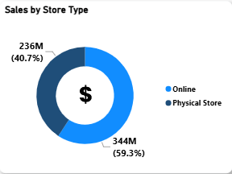

**Key Finding:**  
Online sales generated approximately 59% of total sales, compared with approximately 41% from physical stores.

**Business Insight:**  
LagosMart's revenue is more strongly driven by its online channel, indicating that digital purchasing is an important contributor to overall sales.

**Recommendation:**  
LagosMart should strengthen its online sales strategy through improved digital customer engagement, product visibility, and purchasing convenience while evaluating opportunities to improve the performance of physical stores.

### Sales by Customer Type

**Business Question:**  
How does sales performance differ between new and returning customers?

**Visual:**  
Sales by Customer Type — donut chart.

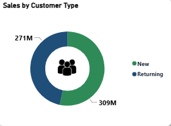

**Key Finding:**  
New customers generated higher sales revenue than returning customers during the period analyzed.

**Business Insight:**  
LagosMart's sales performance is more heavily driven by new customer acquisition than revenue from returning customers. While this demonstrates the ability to attract new buyers, the lower contribution from returning customers presents an opportunity to strengthen retention and repeat purchasing.

**Recommendation:**  
LagosMart should develop customer retention initiatives such as personalized promotions, loyalty rewards, post-purchase engagement, and targeted offers to encourage first-time customers to make repeat purchases.

### Sales by Payment Method

**Business Question:**  
Which payment method generated the highest sales revenue?

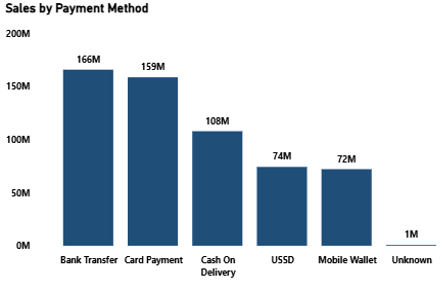

**Visual:**  
Sales by Payment Method — column chart.

**Key Finding:**  
Bank Transfer generated the highest sales revenue among the available payment methods, while Mobile Wallet generated the lowest.

**Business Insight:**  
Bank Transfer is the dominant payment method by sales revenue, indicating strong customer usage of bank-based payments. The relatively low contribution from Mobile Wallet suggests lower adoption of that payment option. The presence of an Unknown payment category also indicates a data-quality issue requiring further review.

**Recommendation:**  
LagosMart should maintain and optimize Bank Transfer as a key payment option while investigating the low adoption of Mobile Wallet and reviewing Unknown payment records to improve transaction data accuracy. Payment processing and checkout experience should also be assessed where appropriate.

## Product Performance

The Product Performance analysis evaluates revenue contribution, profitability, product-level performance, and profit margins across LagosMart's product portfolio.

### Profit by Product Category

**Business Question:**  
Which product category generated the highest and lowest profit?

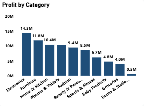

**Visual:**  
Profit by Category — column chart.

**Key Finding:**  
Electronics generated the highest profit, while Books and Stationery recorded the lowest profit.

**Business Insight:**  
Profitability varies considerably across product categories. Electronics is the strongest contributor to overall profit, while Books and Stationery contribute substantially less. This demonstrates that sales volume alone does not determine the financial value of a category.

**Recommendation:**  
LagosMart should optimize the profitability of strong categories such as Electronics while reviewing pricing, costs, discounts, and product mix in lower-profit categories. Inventory and resource allocation decisions should consider both revenue and profitability.

### Most Profitable Products

**Business Question:**  
Which individual products generated the highest profit?

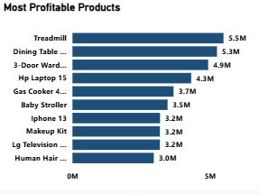

**Visual:**  
Most Profitable Products — Top 10 bar chart.

**Key Finding:**  
The Top 10 products represented the strongest individual profit contributors, with Treadmill recording the highest profit.

**Business Insight:**  
Profitability is concentrated among a relatively small group of products, indicating that certain products contribute disproportionately to overall product profit.

**Recommendation:**  
LagosMart should prioritize the availability and performance monitoring of highly profitable products while investigating the factors driving their profitability, including pricing, costs, demand, and product mix.

### Bottom 10 Products by Profit

**Business Question:**  
Which individual products contributed the least to LagosMart's profitability?

**Visual:**  
Bottom 10 Products by Profit — bar chart.

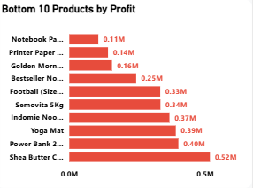

**Key Finding:**  
Several products generated substantially lower profit than the stronger-performing products, with Notepad, Printer Paper A4, and Golden Morn 1kg among the lowest-profit products identified.

**Business Insight:**  
Profitability varies substantially across individual products. Although these products remained profitable rather than loss-making, their weaker contribution warrants further investigation.

**Recommendation:**  
LagosMart should review the pricing, costs, discounts, and sales volumes of the lowest-profit products to identify opportunities for margin improvement. Management should assess the underlying causes before considering repricing, supplier renegotiation, or product discontinuation.

### Sales Revenue versus Product Profitability

**Business Question:**  
Do products with the highest sales revenue also generate the highest profit?

**Visual:**  
Top 10 Products by Sales — bar chart, interpreted alongside the Most Profitable Products analysis.

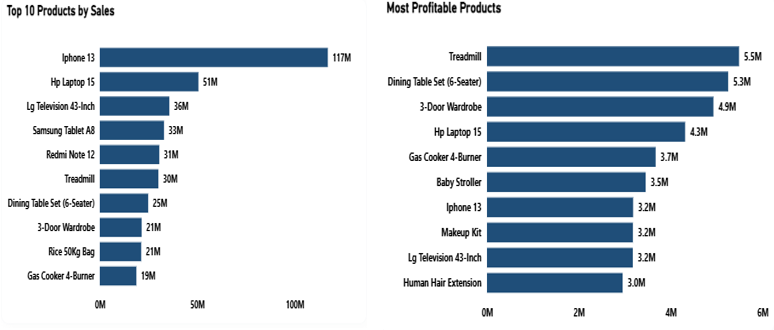

**Key Finding:**  
The products generating the highest sales revenue were not necessarily the most profitable. For example, iPhone 13 ranked highly in sales but did not generate the highest profit, while Treadmill recorded the highest profit despite ranking sixth in sales.

**Business Insight:**  
The difference between sales and profit rankings demonstrates that sales volume alone is not sufficient to evaluate product performance. Pricing, product cost, and discount levels can cause high-sales products to generate comparatively lower profit.

**Recommendation:**  
LagosMart should evaluate product performance using both sales revenue and profitability. Products with high sales but relatively lower profit should be reviewed for pricing, cost, and discount opportunities.

### Average Profit Margin by Product Category

**Business Question:**  
Which product category has the highest and lowest average profit margin?

**Visual:**  
Average Profit Margin by Product Category — column chart.

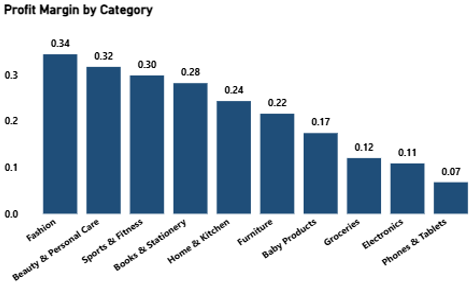

**Key Finding:**  
Fashion recorded the highest average profit margin at approximately 34%, while Phones and Tablets recorded the lowest at approximately 7%.

**Business Insight:**  
Profit margins differ considerably across product categories. Although Phones and Tablets generated the highest sales revenue, the category recorded the lowest average profit margin, while Fashion achieved a substantially higher margin.

**Recommendation:**  
LagosMart should review the pricing, cost, and discount structure of high-revenue but low-margin categories such as Phones and Tablets. Management should also examine the factors contributing to Fashion's stronger margin and determine whether relevant pricing or cost-management practices can be applied elsewhere.

## Customer Performance

The Customer Performance analysis examines customer satisfaction, customer composition, and geographic customer concentration across LagosMart's customer base.

### Customer Rating by Region

**Business Question:**  
How does customer satisfaction vary across LagosMart's regions?

**Visual:**  
Customer Rating by Region — bar chart.

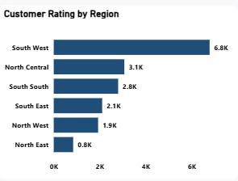

**Key Finding:**  
The Southwest recorded the highest average customer rating, while the Northeast recorded the lowest.

**Business Insight:**  
Customer satisfaction varies across regions, suggesting that factors affecting customer experience may differ between markets.

**Recommendation:**  
LagosMart should investigate the factors contributing to stronger satisfaction in the Southwest and assess whether successful practices can be adapted elsewhere. The business should also investigate lower satisfaction in the Northeast, including product availability, delivery experience, order fulfillment, and service quality.

### Customer Rating by Category

**Business Question:**  
Which product categories received the highest and lowest average customer ratings?

**Visual:**  
Customer Rating by Category — bar chart.

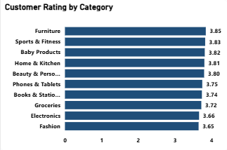

**Key Finding:**  
Grocery recorded the highest average customer rating at approximately 3.85, while Furniture, Books and Stationery, and Sports and Fitness recorded the lowest ratings at approximately 0.7 in the original category-level visualization.

**Business Insight:**  
Customer ratings vary across product categories, with Grocery receiving the strongest rating and several categories recording substantially lower ratings. The differences indicate that customer experience may vary depending on the category purchased.

**Recommendation:**  
LagosMart should investigate the factors contributing to stronger ratings in Grocery and review product quality, fulfillment, delivery experience, and customer feedback for lower-rated categories to identify the main drivers of dissatisfaction.

### Customer Rating by Customer Type

**Business Question:**  
How are recorded customer ratings distributed between new and returning customers?

**Visual:**  
Distribution of Recorded Customer Ratings by Customer Type — donut chart.

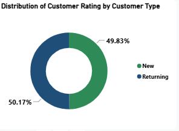

**Key Finding:**  
New customers accounted for 50.17% of recorded customer ratings, while returning customers accounted for 49.83%, indicating a nearly even distribution.

**Business Insight:**  
Recorded customer feedback is relatively balanced between new and returning customers, providing perspectives from both customer groups rather than being dominated by one segment.

**Recommendation:**  
LagosMart should continue monitoring satisfaction across both customer groups and investigate whether the issues affecting new customers differ from those affecting returning customers. Segmenting customer feedback can support more targeted improvements to customer experience.

### Customer Type Distribution

**Business Question:**  
How is LagosMart's customer base distributed between new and returning customers?

**Visual:**  
Customer Type Distribution — donut chart.

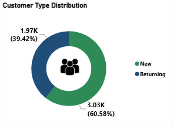

**Key Finding:**  
New customers represented approximately 60.58% of the customer base, while returning customers represented approximately 39.42%.

**Business Insight:**  
LagosMart's customer base is weighted towards new customers, indicating stronger customer acquisition than repeat-customer representation during the period analyzed.

**Recommendation:**  
LagosMart should complement customer acquisition efforts with retention strategies such as loyalty programmes, personalized offers, and post-purchase engagement designed to convert first-time buyers into repeat customers.

### Top 10 States by Customer Distribution

**Business Question:**  
Which states have the highest customer concentration among the Top 10 states?

**Visual:**  
Top 10 Customer Distribution by State — column chart.

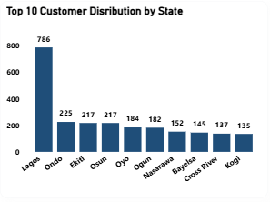

**Key Finding:**  
Lagos recorded the highest customer count among the Top 10 states, with 786 customers, while Kogi recorded 135 customers within the same Top 10 group.

**Business Insight:**  
Customer concentration is uneven across states, with Lagos accounting for a substantially larger customer base than the other leading states. This indicates that customer reach is concentrated in a limited number of markets.

**Recommendation:**  
LagosMart should continue strengthening customer engagement in high-concentration markets while evaluating opportunities to expand customer reach in lower-representation states. Expansion decisions should consider market demand, sales potential, and operational feasibility rather than customer count alone.

## Operational Performance

The Operational Performance analysis evaluates returns, delivery outcomes, cancellations, and the relationship between payment methods and order fulfillment.

### Return Rate by Category

**Business Question:**  
Which product categories have the highest and lowest return rates?

**Visual:**  
Return Rate by Category — bar chart.

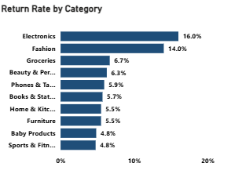

**Key Finding:**  
Electronics recorded the highest return rate at 16.0%, while Baby Products and Sports and Fitness recorded the lowest return rates at 4.8%.

**Business Insight:**  
Return rates vary across product categories, with returns more concentrated in Electronics than in the lower-return categories. This pattern may reflect differences in product quality, customer expectations, product descriptions, or fulfillment.

**Recommendation:**  
LagosMart should investigate the main drivers of returns in Electronics by reviewing return reasons, product quality, product descriptions, and fulfillment processes. The business should also monitor recurring return patterns and assess practices associated with lower-return categories.

### Delivery Status Distribution

**Business Question:**  
What is the overall delivery status of LagosMart's orders?

**Visual:**  
Delivery Status Distribution — donut chart.

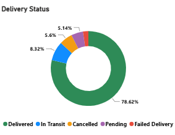

**Key Finding:**  
Delivered orders accounted for approximately 78.62% of total orders. The remaining orders were distributed across in-transit, cancelled, pending, and failed statuses.

**Business Insight:**  
The majority of orders were successfully delivered, indicating generally positive fulfillment performance. However, undelivered orders represent potential operational friction and may affect revenue realization and customer experience.

**Recommendation:**  
LagosMart should monitor undelivered orders through delivery-status tracking and investigate the causes of cancellations, failed deliveries, and prolonged pending or in-transit orders. Reducing avoidable exceptions could improve fulfillment efficiency and customer experience.

### Payment Method vs Cancellation Rate

**Business Question:**  
Which payment methods are associated with the highest cancellation rates?

**Visual:**  
Payment Method vs Cancellation Rate — table.

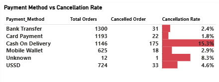

**Key Finding:**  
Cash on Delivery recorded the highest cancellation rate at approximately 15.3%, while Card Payment recorded the lowest among the major payment methods at approximately 1.8%.

**Business Insight:**  
Cash on Delivery is associated with a substantially higher cancellation rate than the other major payment methods. This pattern warrants investigation into factors such as customer commitment, order confirmation, and delivery-related issues.

**Recommendation:**  
LagosMart should investigate the drivers of Cash on Delivery cancellations, including order confirmation, customer commitment, and failed delivery attempts. Order verification processes should be strengthened while maintaining appropriate payment flexibility for customers.

### Delivery Status by Payment Method

**Business Question:**  
How does delivery performance vary across payment methods?

**Visual:**  
Delivery Status by Payment Method — stacked bar chart.

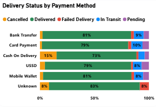

**Key Finding:**  
Delivery outcomes varied across payment methods, with Cash on Delivery recording approximately 73% delivered orders and the highest cancellation share at approximately 15%. Bank Transfer and Mobile Wallet recorded approximately 81% delivered orders.

**Business Insight:**  
Cash on Delivery demonstrated weaker fulfillment performance than the other major payment methods, driven primarily by its substantially higher cancellation rate. This suggests that the payment method may be associated with greater order-commitment or fulfillment challenges.

**Recommendation:**  
LagosMart should investigate the Cash on Delivery order journey, particularly order confirmation, customer commitment, and failed delivery attempts, to determine the causes of higher cancellations. Delivery performance should continue to be monitored across payment methods to identify opportunities for improving fulfillment efficiency.

### Order Status Distribution

**Business Question:**  
What is the overall outcome of LagosMart's orders?

**Visual:**  
Order Status Distribution — bar chart.

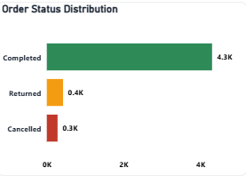

**Key Finding:**  
The majority of LagosMart orders were completed, with approximately 4.3K completed orders, while returned and cancelled orders represented smaller portions of total order volume.

**Business Insight:**  
LagosMart successfully completed the majority of recorded orders, indicating generally positive overall order performance. However, returned and cancelled orders represent potential revenue leakage and operational inefficiency.

**Recommendation:**  
LagosMart should maintain its strong order-completion performance while investigating the underlying causes of returned and cancelled orders. Reducing avoidable exceptions could improve revenue realization and operational efficiency.

## Executive Strategic Recommendations

Based on the findings from the sales, product, customer, and operational analyses, the following recommendations are proposed:

1. **Strengthen high-performing markets while addressing regional gaps**  
   LagosMart should continue leveraging strong-performing regions and states while conducting targeted market assessments in lower-performing markets to identify barriers to revenue growth and opportunities for expansion.

2. **Manage products based on both revenue and profitability**  
   Product decisions should consider sales revenue, profit contribution, and profit margin rather than sales volume alone. High-sales but low-margin products should be reviewed for pricing, cost, and discount opportunities.

3. **Protect and optimize high-profit products**  
   The most profitable products should receive appropriate inventory availability, performance monitoring, and targeted marketing attention to protect their contribution to overall profitability.

4. **Strengthen customer retention**  
   Since the customer base contains a larger proportion of new customers than returning customers, LagosMart should complement customer acquisition with retention initiatives such as loyalty programs, personalized promotions, and post-purchase engagement.

5. **Improve payment and cancellation performance**  
   The high cancellation rate associated with Cash on Delivery should be investigated, particularly around order confirmation, customer commitment, and delivery attempts. Bank transfer should remain an important payment channel while lower-adoption payment methods and unknown payment records are reviewed.

6. **Reduce avoidable operational exceptions**  
   LagosMart should monitor cancellations, failed deliveries, pending orders, and returns to identify recurring operational issues. Particular attention should be given to categories and payment methods associated with higher return or cancellation rates.

7. **Improve data quality and reporting controls**  
   Payment records classified as "Unknown", duplicate identifiers, missing values, and other data-quality issues should be monitored through stronger data-entry and validation controls to improve the reliability of future business reporting.

## Conclusion

The LagosMart Retail Sales & Profitability Analysis provides a consolidated view of the business's revenue performance, product profitability, customer behaviour, and operational outcomes.

The analysis shows that sales performance varies considerably across regions, states, product categories, customer groups, store types, and payment methods. Strong revenue performance does not always translate into stronger profitability, highlighting the importance of evaluating both sales and profit when making product and resource allocation decisions.

The product analysis further demonstrates that profitability is concentrated among certain products and categories, while some high-revenue categories operate with comparatively lower profit margins. Customer analysis also shows an opportunity to strengthen retention, while operational analysis highlights the need to monitor returns, cancellations, and delivery exceptions.

Overall, LagosMart's performance can be strengthened by combining revenue growth with disciplined profitability management, customer retention, payment optimization, and operational improvement. The findings provide management with evidence-based areas for further investigation and decision-making.

## Executive Summary

The LagosMart Retail Sales & Profitability Analysis is an end-to-end business analytics project developed to evaluate sales performance, product profitability, customer behaviour, and operational performance across a Nigerian retail business.

The analysis used a synthetic AI-generated retail dataset containing approximately 5,000 records. Excel, MySQL, and Power BI were used for data preparation, validation, analysis, visualization, and business reporting.

The analysis identified clear differences in performance across regions, states, product categories, customer segments, store types, and payment methods. The Southwest recorded the strongest regional sales performance, while the Northeast recorded the lowest. Online sales contributed a larger share of revenue than physical stores, while new customers generated more sales revenue than returning customers.

Product analysis showed that sales volume and profitability were not always aligned. Phones and tablets generated the highest category sales revenue but recorded the lowest average profit margin among the categories analyzed, while Fashion recorded the highest average profit margin. This demonstrates the importance of evaluating product performance using both revenue and profitability measures.

Customer analysis showed a customer base weighted toward new customers, creating an opportunity to strengthen customer retention and repeat purchasing. Customer ratings also varied across regions and product categories, indicating areas where customer experience may require further investigation.

Operational analysis highlighted differences in returns, delivery outcomes, and payment-related cancellations. Cash on Delivery recorded a substantially higher cancellation rate than the other major payment methods, while delivery and order-status analysis showed that most orders were successfully completed or delivered but that cancellations, returns, failed orders, and other exceptions remain areas for monitoring.

Overall, the analysis indicates that LagosMart should balance revenue growth with profitability management, customer retention, payment optimization, and operational efficiency. The findings provide a data-driven foundation for management to investigate performance gaps and prioritize improvement opportunities.

## Appendix

### A. SQL Analysis

SQL was used to support exploratory analysis and answer selected business questions relating to sales, customers, products, and operational performance.

Selected SQL analyses included:

- Sales performance by region and state
- Sales performance by customer type
- Sales performance by payment method
- Product profitability analysis
- Customer distribution analysis
- Cancellation and operational analysis

The SQL scripts used during the project are included in the repository for technical reference.

### B. Technical Notes

- The dataset used in this project is synthetic and AI-generated for portfolio and analytical purposes.
- Data cleaning and validation were performed before the final analysis.
- Duplicate records and duplicate transaction identifiers were investigated during data preparation.
- Missing values and inconsistent data formats were reviewed and addressed where appropriate.
- Total Orders in Power BI was calculated using a distinct count of Transaction ID after validation.
- Customer ratings were analyzed using average customer rating rather than summation.
- Order Status and Delivery Status were treated as separate operational measures.
- Payment records classified as "Unknown" were retained and identified as a data-quality consideration rather than being assigned to another payment method.
- Dashboard metrics and visuals were developed in Power BI using validated data.

### C. Project Files

The repository contains the supporting files used for the analysis, including the Power BI dashboard, Excel analysis, SQL scripts, and final project report.
